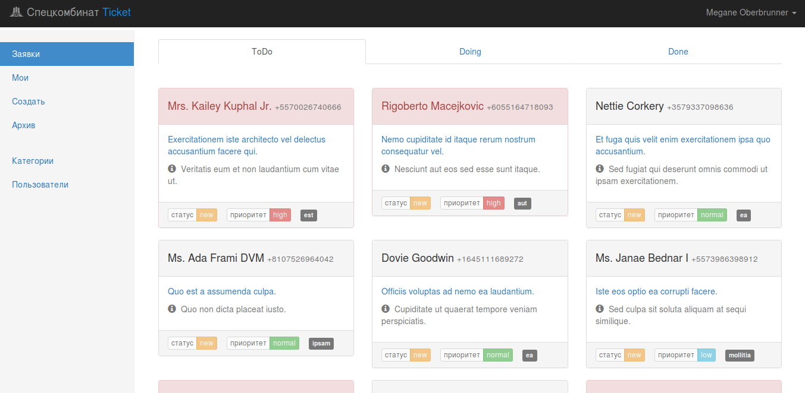
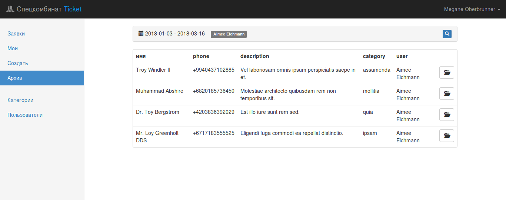
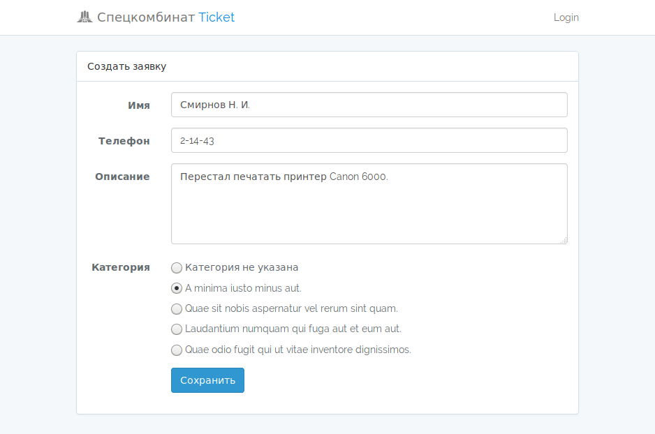

# Speckombinat Ticket

Простой тикет-менеджер группы поддержки пользователей для автоматизации обработки запросов клиентов.

### Возможности

 * имеет дашборд, где тикеты, для наглядности, разбиты на 3 категории ToDo (новые тикеты), Doing(кто какие тикеты выполняет), Done(закрытые тикеты) 
 * специалист группы поддержки может видеть назначенные ему тикеты 
 * есть поиск по архиву тикетов
 * тикету можно назначить:
  * приоритет выполнения (low, normal, high)
  * указать текущий статус (new, in progress, awaiting, closed)
  * выбрать категорию указанной проблемы (например, "заправка картиджа", "проблема с 1С", "проблема с компьютером" и прочее)

### Как работает

 * создается тикет
  * клиент создаёт самостоятельно 
  * или его создает сотрудник группы поддержки при поступлении запроса от клиента
 * новый тикет попадает в список ToDo, откуда его берет на выполнение свободный специалист
 * закрепленный за специалистом тикет переходит в список Doing
 * после выполнения работ тикет закрывается и переходит во вкладку Done
 
## Скриншоты
 
dashboard:

поиск по архиву:

создание тикета:

